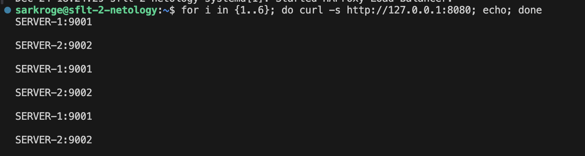
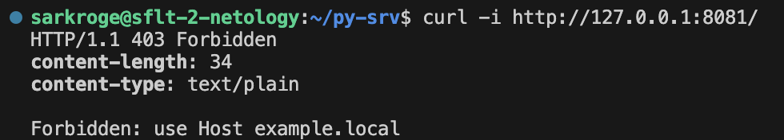
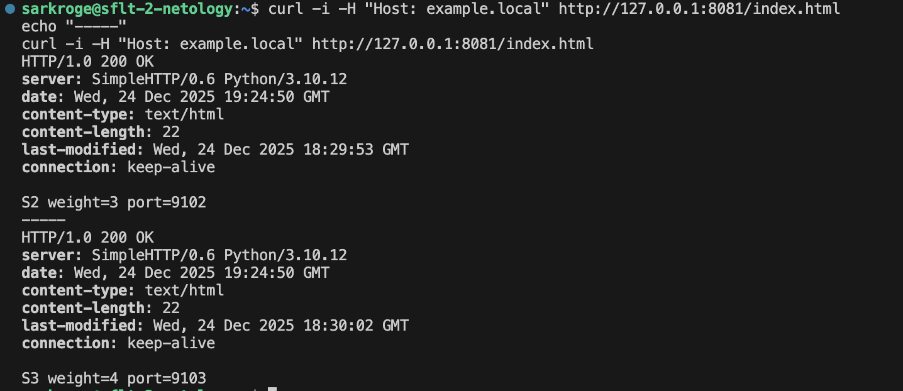
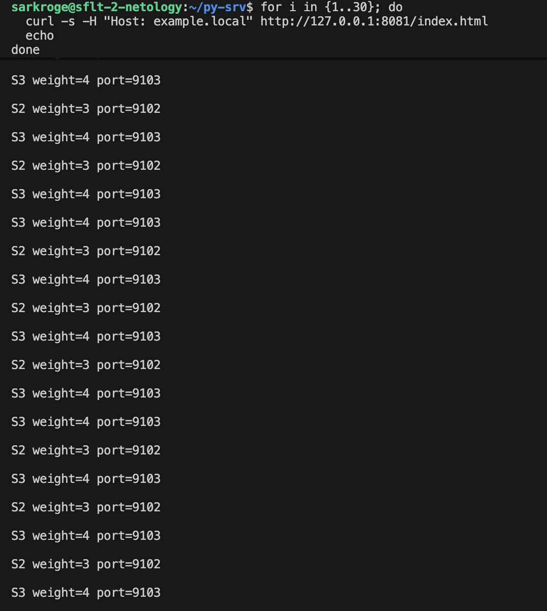

# Домашнее задание к занятию 2 «Кластеризация и балансировка нагрузки»
**Студент:** Егор Краснов

---

## Задание 1. Балансировка Round-robin на 4 уровне (TCP)

### Описание
На одной виртуальной машине запущены два simple python HTTP-сервера на разных портах.
С помощью HAProxy настроена балансировка Round-robin на 4 уровне (TCP).

### Запуск python-серверов
```bash
python3 -m http.server 9001 --directory s1
python3 -m http.server 9002 --directory s2
```

### Конфигурация HAProxy

[Файл конфигурации HAProxy Задание 1](task1/haproxy.cfg)

### Проверка
```bash
for i in {1..6}; do curl http://127.0.0.1:8080; echo; done
```

### Результат
При каждом запросе ответы приходят поочерёдно от разных backend-серверов.

**Скриншот проверки Round-robin балансировки:**



---

## Задание 2. Weighted Round Robin на 7 уровне (HTTP)

### Описание
Запущены три simple python сервера.
HAProxy настроен на балансировку Weighted Round Robin **только для домена example.local**.

Вес серверов:
- server1 — weight 2
- server2 — weight 3
- server3 — weight 4

### Запуск python-серверов
```bash
python3 -m http.server 9101 --directory s1
python3 -m http.server 9102 --directory s2
python3 -m http.server 9103 --directory s3
```

### Конфигурация HAProxy

[Файл конфигурации HAProxy Задание 2](task2/haproxy.cfg)

### Проверка без домена
```bash
curl -i http://127.0.0.1:8081/
```
**Скриншот запроса без указания домена example.local:**



**Результат:**  
`HTTP/1.1 403 Forbidden`

### Проверка с доменом example.local
```bash
for i in {1..30}; do
  curl -s -H "Host: example.local" http://127.0.0.1:8081/index.html
done
```

### Результат
Запросы успешно балансируются между backend-серверами.
Частота ответов соответствует заданным весам (2 / 3 / 4).

**Скриншот успешной обработки запросов с доменом example.local:**



**Скриншот распределения нагрузки (Weighted Round Robin):**


---

## Вывод
В ходе работы были успешно настроены:
- балансировка Round-robin на 4 уровне;
- балансировка Weighted Round Robin на 7 уровне;
- фильтрация трафика по HTTP Host.

HAProxy корректно распределяет нагрузку и ограничивает доступ по доменному имени.
